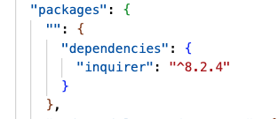

  

  # read-me-generator

  ##  Description
  This application generates a README.md using Node.js. In fact, what you are reading now was generated using this application. I filled out the information then went back and added a few more details including a video walkthrough of how to use this.

  [Deployable Link](https://chelseaburnham.github.io/password-generator/)
  
  ##  Table of Contents
  * [Installation](#installation)
  * [Usage](#usage)
  * [License](#license)
  * [Contributing](#contributing)
  * [Questions](#questions)
  
  ##  Installation
  npm install inquirer:  
  
  
  ##  Usage
  Here is a [Video Walkthrough](https://watch.screencastify.com/v/Cpp3irStMoa004p7Lyj1) of how this application can be used. 
  
  ## License
    This is licensed under the MIT license.
  
  ##  Contributing
 [w3schools](https://www.w3schools.com/) 
 [Stack Overflow](https://stackoverflow.com/?newreg=8cd9776f072c449eac02d1ab363597c8)
  
  ##  Questions
  If you have any questions about the repo, feel free to email me at chelseaburnham0@gmail.com. You can find more of my work at [http://github.com/chelseaburnham].